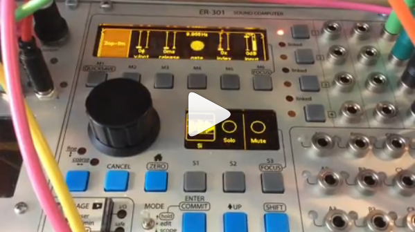

# Presets

All presets (should be) compatible with firmware 0.4.19
##### Synth building blocks
* [ad.unit](#ad)
* [ad ext.unit](#ad_exp)
* [ad exp var.unit](#ad_exp_var)
* [decay env.unit](#decay_env)
* [stepped random.unit](#stepped_random)

##### Voices
* [2op-fm](#2op-fm)

##### Drums
* [bd1.unit](#bd1)
* [bd2.unit](#bd2)

##### Trigger/gate
* [gated burst.unit](#gates_burst)
* [gate to trigger.unit](#gate_to_trigger)

##### Audio mangling
* [buffer player.unit](#buffer_player)
* [stutter.unit](#stutter)

##### Effects
* [cheap reverb 1.unit](#cheap_reverb_1)
* [cheap reverb 2.unit](#cheap_reverb_2)
* [mono to stereo 1.unit](#mono_to_stereo_1)
* [mono to stereo 2.unit](#mono_to_stereo_2)
* [poor mans reverb 1.unit](#poor_mans_reverb_1)
* [poor mans reverb 2.unit](#poor_mans_reverb_2)

## Synth building blocks
### ad.unit 
AD envelope with variable attack and decay, works with short triggers as input.  
Unit type: custom-unit  
CPU: 3.3%  
Controls:
* attack (0-5s)
* decay (0-5s)

### ad exp.unit 
AD envelope (exponential response) with variable attack and decay, works with short triggers as input.  
Unit type: custom-unit  
CPU: 4.8%  
Controls:
* attack (0-5s)
* decay (0-5s)

### ad exp var.unit
AD envelope (variable exponential response) with variable attack and decay, works with short triggers as input.  
Unit type: custom-unit  
CPU: 5.6%  
Controls:
* attack (0-5s)
* decay (0-5s)
* exp (0-1)

### decay env.unit
Very cheap decay envelope with exponential decay. This is just a slew-limiter with feedback (no fancy GUI) to keep it cheap. Adjusting time, might require adjusting the negative gain on the feedback. A bit unstable in a charming way.  
Unit type: slew-limiter  
CPU: 0.24%  
Controls:  
* time: 3ms-786.32s  

### stepped random.unit
Generte random value on trigger.  
Unit type: mixer-channel  
CPU: 1.95%  
Controls:  
* trigger

## Voices
### 2op-fm.unit
  
Percussive FM voice inspired by [the 2opfm module by Super Synthesis](https://www.supersynthesis.com/products/2opfm?variant=3710980620328)  
Unit type: mixer-channel  
CPU: 8.75  
Controls:
* v/oct
* index (0-20)
* gate
* release (0-1s)

## Drums
### bd1.unit
No so versatile kick drum.  
Unit type: mixer-channel  
CPU: 8%  
Controls:
* amp rel (amplitude decay time)
* pitch amt (pitch amount)
* pitch rel (amplitude decay time)

### bd2.unit
Quite versatile kick drum, with lots of sweet spots.  
Unit type: mixer-channel  
CPU: 10%  
Controls:
* freq 0-1 (frequency env amount)
* decay 0-1s
* feedback 0-1

## Trigger/gate
### gated burst.unit
  
Emits bursts while receiving a gate. The bursts are pulses with intervals of "burst time" and length "burst time/2".  
Unit type: custom-unit  
Controls:  
* burst time: 0-1000 ms  

### gate to trigger.unit
  
Converts incomming gates to triggers of selected length.  
Unit type: custom-unit  
Controls:  
* trigger time (1-1000ms)

## Audio mangling
### buffer player.unit
Grabs audio and play it pitched.  
Unit type: two-bands  
Controls:
* v/oct
* grab
* dry/wet

### stutter.unit
Repeats snip of audio on gate high.  
Unit type: custom-unit  
CPU: 7.2%  
Controls:
* clock
* gate
* mult
* div

## Effects
### cheap reverb 1.unit + cheap reverb 2.unit
  
Unit type: six-bands  
CPU usage: 7.2%  
Room size reverb that doesn't tax the CPU. Works on stereo channel, but is mono in, mono out.  
Controls:
* size (0-1)  

### mono to stereo 1.unit
Delays one channel, very simple/stupid, will flange in mono.  
Unit type: two-bands  
CPU (on stereo channel): 3.2%  
Controls:
* width (0-1)

### mono to stereo 2.unit
More sophisticated (using comb filters), better mono compatibility, but more
expensive on the CPU.  
Unit type: two-bands  
CPU (on stereo channel): 18%  
Controls:
* width (0-1)
* depth (0-1)

### poor mans reverb 1.unit

  
Granular reverb based on [Neil Parfitts reverb idea](https://www.youtube.com/watch?v=swXpnqot4-Q), recording with a Dub Looper, with dub controlled by incoming signal.  
Unit type: two-bands  
CPU (mono version on mono channel): ~24%  
CPU (stereo version on stereo channel): ~23%  
Controls:  
* length (10ms-1s): length of grains
* speed (10-500Hz): speed of grains
* scrub (0-1): random scrubbing of playhead
* dry (0-1)
* wet (0-1)

### poor mans reverb 2.unit
Variation of [poor mans reverb 1.unit](#poor_mans_reverb_1), but recording with a Feedback Looper for a different flavor.  
Unit type: two-bands
CPU (on stereo channel): ~26%  
Controls:  
* length (0-1s): length of grains
* speed (10-500Hz): speed of grains
* v/oct: pitch of reverb  
* dry (0-1)
* wet (0-1)

